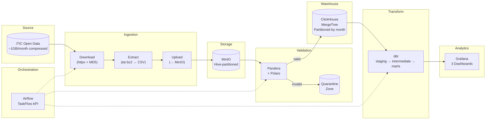
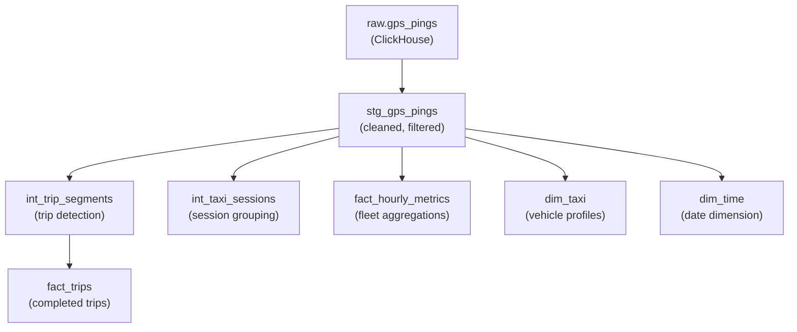

# 🚕 Bangkok Taxi Data Engineering Platform

A production-grade data platform that processes **100M+ GPS probe records** from Bangkok taxis, demonstrating modern data engineering practices: batch ingestion, data quality validation, dimensional modeling, OLAP analytics, and pipeline orchestration.

Built with real-world data from the [iTIC Foundation](https://www.iticfoundation.org/) (CC-BY 4.0).

---

## 🏗️ Architecture



---

## 📊 Dataset

| Property | Value |
|----------|-------|
| **Source** | [iTIC Open Data Archives](https://itic.longdo.com/opendata/probe-data/) |
| **License** | CC-BY 4.0 |
| **Coverage** | Thailand (focus: Bangkok metro) |
| **Period** | Jan 2017 — Dec 2025 |
| **Volume** | ~1-2.5 GB compressed per month |
| **Records** | 96M–247M per analysis period |
| **Frequency** | Every 1 min (engine on), 3 min (engine off) |

**Schema (7 fields, no header):**
```
VehicleID,gpsvalid,lat,lon,timestamp,speed,passenger_lamp,engine_acc
```

| Field | Type | Description |
|-------|------|-------------|
| `VehicleID` | string | Hashed unique vehicle identifier |
| `gpsvalid` | 0/1 | GPS fix quality (1 = enough satellites) |
| `lat` | float | Latitude (WGS84, 5 decimal places) |
| `lon` | float | Longitude (WGS84, 5 decimal places) |
| `timestamp` | datetime | GPS time (UTC+7 Bangkok) |
| `speed` | int | Speed in km/h |
| `passenger_lamp` | 0/1 | **1 = vacant (light ON)**, 0 = occupied |
| `engine_acc` | 0/1 | Engine switch: 1 = running, 0 = off |

---

## 🚀 Quick Start

### Prerequisites
- Docker & Docker Compose
- Python 3.11+
- ~15 GB free disk space (for 1 month of data)

### 1. Clone & Configure
```bash
git clone https://github.com/your-username/bangkok-taxi-data-platform.git
cd bangkok-taxi-data-platform
cp .env.example .env
```

### 2. Start Infrastructure
```bash
make up
```

This starts all containerized services:
| Service | URL | Role / Credentials |
|---------|-----|--------------------|
| **Control Panel UI** | **http://localhost:5000** | **Interactive Mock Simulator & Pipeline Control** |
| **Grafana** | http://localhost:3000 | Dashboards (`admin` / `grafana_secret`) |
| **Airflow** | http://localhost:8080 | Orchestrator (`admin` / `admin`) |
| **MinIO** | http://localhost:9001 | S3 Data Lake (`minio_admin` / `minio_secret_123`) |
| **ClickHouse** | http://localhost:8123 | OLAP Database (Native port: 9009) |

---

### 3. One-Click Interactive Demo (Option A — Web UI)
Open **[http://localhost:5000](http://localhost:5000)** in your browser:
- Select from 5 traffic scenarios:
  - 🚦 **Normal Weekday**: Regular morning/evening rush hour peaks
  - 🌧️ **Monsoon Rain Gridlock**: Average speed drops to 8-15 km/h, 90% occupancy
  - ✈️ **Airport Express Surge**: High-speed highway trips to BKK & DMK
  - 🏮 **Midnight Bangkok**: Late-night nightlife surge in Thonglor, Sukhumvit, RCA
  - ⚠️ **Chaos Engineering Mode**: Injects 5% corrupted records to test Pandera quarantine & dbt tests
- Click **⚡ Run Full Pipeline (One-Click)** to generate, validate, load, transform, and test automatically!

---

### 4. One-Command CLI Demo (Option B — Terminal)
```bash
make demo
```
*Runs the full lifecycle inside Docker: generates mock data ➡️ validates & loads ➡️ dbt run ➡️ dbt test.*

---

### 5. Ingest Real iTIC Data (Full Dataset via Airflow)
1. Open **[http://localhost:8080](http://localhost:8080)**
2. Unpause and trigger `taxi_ingestion` DAG with parameter `{"year_month": "201802"}`
3. Watch the autonomous pipeline stream ~96M+ rows into ClickHouse!

---

### 6. View Analytics Dashboards
Open **[http://localhost:3000](http://localhost:3000)** ➡️ Dashboards ➡️ Bangkok Taxi folder:
1. **🚕 Fleet Overview**: Active taxis count, empty ratio gauge, speed trends
2. **📍 Hotspot Analysis**: Top pickup/dropoff geohashes, peak demand hours, OD matrix
3. **🚖 Trip Analytics**: Trip duration/distance distributions, average speeds

---

## 🧱 Project Structure

```
bangkok-taxi-data-platform/
├── docker-compose.yml              # Full infrastructure stack
├── Makefile                        # Developer shortcuts
│
├── src/                            # Python application code
│   ├── config/settings.py          # Pydantic centralized config
│   ├── ingestion/                  # Download → Extract → Upload
│   ├── validation/                 # Pandera schemas + Polars validators
│   └── loaders/                    # ClickHouse bulk loader
│
├── dbt_taxi/                       # dbt transformation project
│   ├── models/staging/             # stg_gps_pings (clean + filter)
│   ├── models/intermediate/        # Trip detection, sessionization
│   ├── models/marts/               # fact_trips, fact_hourly_metrics
│   └── macros/                     # haversine, geohash
│
├── airflow/dags/                   # Airflow DAGs
│   ├── taxi_ingestion_dag.py       # Full pipeline orchestration
│   └── taxi_dbt_dag.py             # dbt transformation orchestration
│
├── infrastructure/                 # Docker configs + Grafana provisioning
├── scripts/                        # Sample data generator + ClickHouse DDL
└── tests/                          # Unit + integration tests
```

---

## 🔄 dbt Model Lineage



---

## 📈 Analytics Use Cases

| Use Case | Model | Description |
|----------|-------|-------------|
| Active taxis per hour | `fact_hourly_metrics` | How many taxis are on the road each hour? |
| Empty taxi ratio | `fact_hourly_metrics` | What % of taxis are cruising without passengers? |
| Pickup/dropoff hotspots | `fact_trips` | Where do most pickups/dropoffs happen? |
| Average speed by area | `fact_hourly_metrics` | Congestion proxy by time of day |
| Trip duration distribution | `fact_trips` | How long do typical trips take? |
| OD matrix | `fact_trips` | Most common origin-destination pairs |
| Peak hours | `fact_hourly_metrics` | When is taxi demand highest? |
| Vehicle utilization | `dim_taxi` | How efficiently is each taxi used? |

---

## 🧪 Testing

```bash
# Unit tests (no Docker needed)
make test-unit

# Integration tests (uses sample data)
make test-integration

# dbt tests
make dbt-test

# All tests
make test
```

---

## ⚡ Key Design Decisions

| Decision | Rationale |
|----------|-----------|
| **ClickHouse over PostgreSQL** | 100M+ rows with time-series queries — ClickHouse is 10-100x faster for OLAP |
| **Polars over Pandas** | 3-5x faster CSV processing, lower memory usage for large files |
| **Incremental dbt models** | Process only new data, not the full 100M+ history each run |
| **MergeTree partitioned by month** | Efficient partition pruning for date-range queries |
| **SummingMergeTree for hourly metrics** | Automatic aggregation of overlapping data on merge |
| **Geohash for spatial analysis** | ~1.2km blocks (precision 6) — good balance of granularity vs cardinality |
| **MinIO as data lake** | S3-compatible, runs locally, same API as AWS S3 for cloud migration |

---

## 📄 License

This project is licensed under the MIT License.

**Data attribution**: GPS probe data provided by [iTIC Foundation](https://www.iticfoundation.org/) under [CC-BY 4.0](https://creativecommons.org/licenses/by/4.0/).
