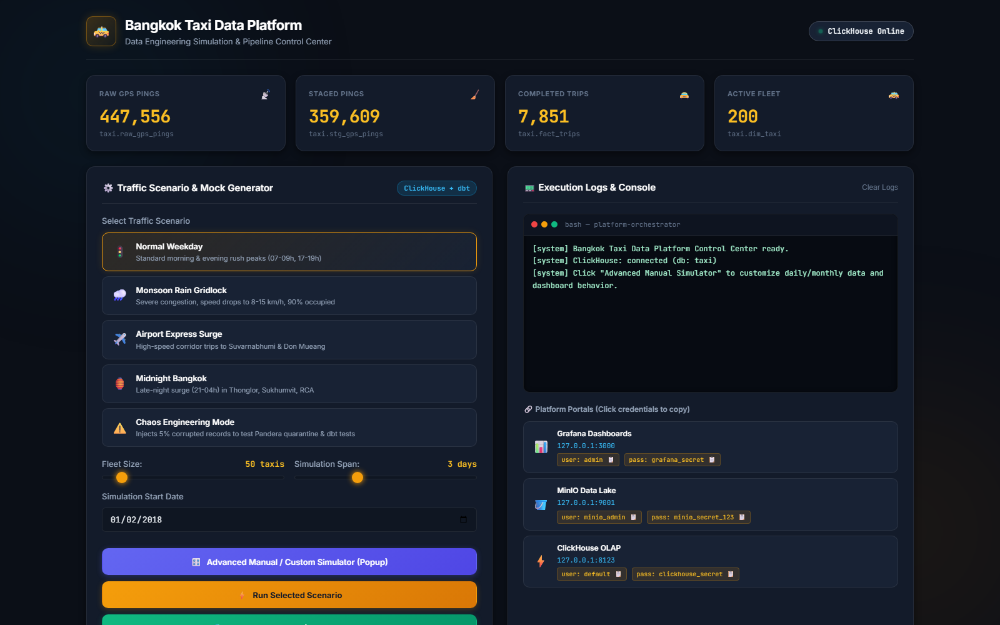
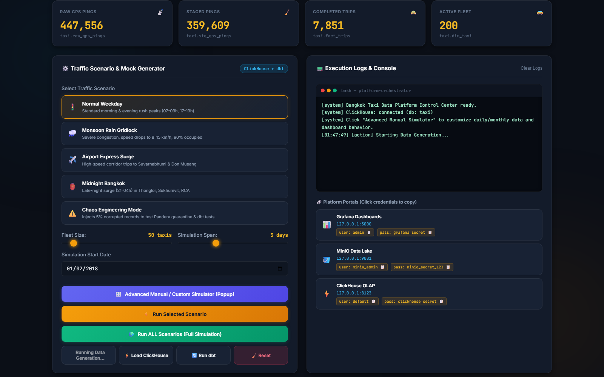
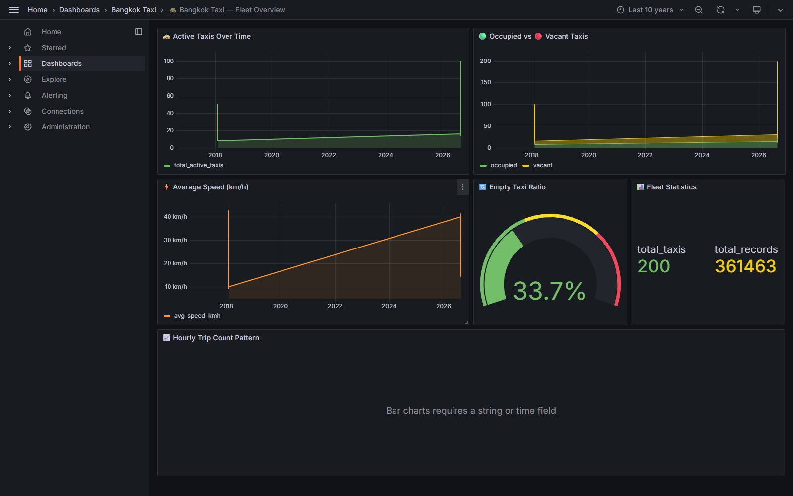
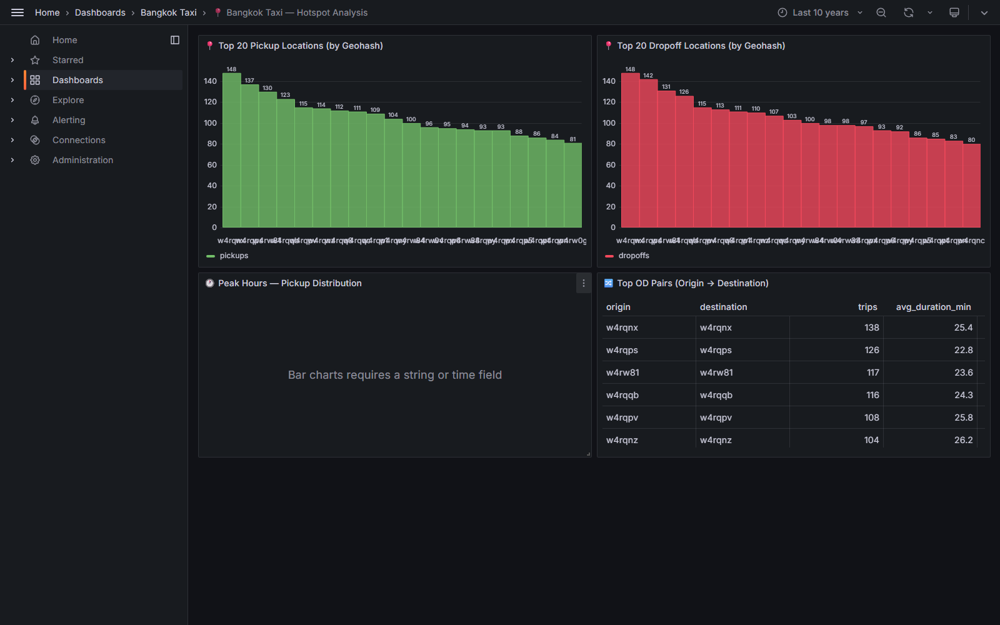
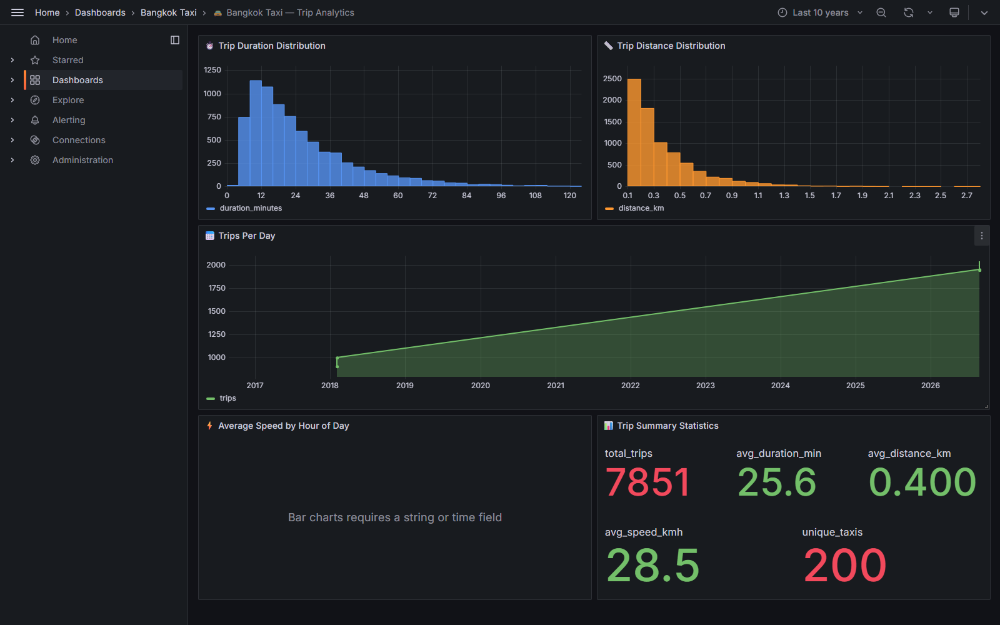

# 🚕 Bangkok Taxi Data Engineering Platform (Demo & Simulation Suite)

A self-contained, production-grade **Ultra-Lean ELT Data Platform Demo** designed to simulate, ingest, transform, and visualize **Bangkok taxi GPS probe data** (modeled after the 100M+ record [iTIC Open Data Foundation](https://www.iticfoundation.org/) schema).

> [!NOTE]
> **Demo & Simulation Platform**: This project runs 100% locally and self-contained. It **does not connect to live external production APIs**. Instead, it features an interactive **in-platform Traffic Simulation Engine** that generates realistic, schema-accurate GPS probe records across customized urban scenarios (rush hours, storm congestion, airport corridors, nightlife surges, and sensor anomaly tests) for rapid local development, benchmarking, and demonstration.

---

## 📸 Screenshots Showcase

### 🖥️ Interactive Web Control Center (`http://127.0.0.1:5000`)
The web control plane allows you to generate mock traffic datasets, trigger MinIO S3 uploads, execute ClickHouse direct ELT loads, and orchestrate dbt models with real-time feedback:



### ⚙️ Advanced Custom Simulation & Scenario Tuning
Configure exact fleet speed targets, occupancy/vacancy percentages, GPS ping intervals, date spans, and sensor error rates:



### 📊 Real-Time Grafana Analytics Dashboards (`http://127.0.0.1:3000`)
Visualizes live OLAP aggregates computed from ClickHouse dimensional marts:

| 🚕 Fleet Overview | 📍 Hotspot & Spatial Demand | 🚖 Trip Analytics & Velocity |
|:---:|:---:|:---:|
|  |  |  |

---

## 🏗️ Architecture (The Ultra-Lean ELT Stack)

```mermaid
graph LR
    subgraph Control Plane
        UI["FastAPI Control Panel\n(Simulation & Pipeline Engine)"]
    end

    subgraph Data Lake
        MINIO[("MinIO\n(Raw S3 Storage)")]
    end

    subgraph Data Warehouse (ClickHouse)
        CH_RAW[("raw_gps_pings\n(ReplacingMergeTree)")]
        DBT["dbt\n(Data Quality & Dimensional Marts)"]
    end

    subgraph Analytics & Visualization
        GF["Grafana\n(3 Pre-provisioned Dashboards)"]
    end

    UI -->|1. Generates Scenario Data| MINIO
    UI -->|2. Triggers S3 Direct Load| CH_RAW
    MINIO -.->|s3() direct read| CH_RAW
    UI -->|3. Triggers Transform & Tests| DBT
    CH_RAW --> DBT
    DBT --> GF
```

---

## 🚦 Built-in Traffic Simulation Scenarios

| Scenario | Description | Target Speed | Target Vacancy | Anomaly Rate |
|:---|:---|:---:|:---:|:---:|
| 🚦 **Normal Weekday** | Regular morning & evening Sukhumvit rush hour flow | ~25 km/h | 35% | 0% |
| 🌧️ **Monsoon Rain Gridlock** | Heavy rainstorm with extreme congestion and high occupancy | ~8–15 km/h | 10% | 2% |
| ✈️ **Airport Express Surge** | High-speed express corridor trips to BKK (Suvarnabhumi) & DMK (Don Mueang) | ~45–70 km/h | 25% | 0% |
| 🏮 **Midnight Bangkok** | Late-night surge around Thonglor, Ekkamai, RCA, and Silom | ~30 km/h | 20% | 1% |
| ⚠️ **Chaos Engineering Mode** | Injects 5–25% corrupted records (invalid bbox, extreme speed) to test dbt assertions | Varies | 50% | 5–25% |

---

## 📊 Dataset Schema (iTIC 7-Field Specification)

```
VehicleID,gpsvalid,lat,lon,timestamp,speed,passenger_lamp,engine_acc
```

| Field | Type | Description |
|:---|:---|:---|
| `VehicleID` | String | Hashed unique vehicle identifier |
| `gpsvalid` | UInt8 | GPS fix quality (1 = valid fix, 0 = insufficient satellites) |
| `lat` | Float64 | Latitude (WGS84, Bangkok bounding box 13.4 to 14.3) |
| `lon` | Float64 | Longitude (WGS84, Bangkok bounding box 100.2 to 101.0) |
| `timestamp` | DateTime | GPS timestamp in Asia/Bangkok time (UTC+7) |
| `speed` | UInt16 | Instantaneous speed in km/h |
| `passenger_lamp` | UInt8 | Vacancy indicator: **1 = Vacant (Light ON)**, 0 = Occupied |
| `engine_acc` | UInt8 | Engine ignition switch: 1 = Running, 0 = Off |

---

## 🚀 Quick Start

### 1. Prerequisites
- Docker & Docker Compose
- Python 3.11+

### 2. Start the Stack (4 Containers Only)
```bash
docker compose up -d
```

| Service | Access URL | Credentials | Role |
|:---|:---|:---|:---|
| **Control Panel UI** | **http://127.0.0.1:5000** | *None (Public)* | Interactive Simulation & Pipeline Engine |
| **Grafana** | http://127.0.0.1:3000 | `admin` / `grafana_secret` | Visual Analytics & Dashboards |
| **MinIO Console** | http://127.0.0.1:9001 | `minio_admin` / `minio_secret_123` | S3 Data Lake Browser (S3 Port: 9000) |
| **ClickHouse HTTP** | http://127.0.0.1:8123 | `default` / `clickhouse_secret` | High-performance OLAP Database |

### 3. Run a Simulation
1. Open **[http://127.0.0.1:5000](http://127.0.0.1:5000)**.
2. Select any traffic scenario (e.g. *Normal Weekday* or *Monsoon Rain*).
3. Click **⚡ Run Pipeline** (or **⚙️ Advanced Custom Simulation**).
4. Watch the pipeline generate data, upload to MinIO, ingest directly into ClickHouse via `s3()`, and execute dbt models.
5. Open **[http://127.0.0.1:3000](http://127.0.0.1:3000)** to explore the updated dashboards.

---

## 🧱 Project Structure

```
bangkok-taxi-data-platform/
├── docker-compose.yml              # Ultra-lean 4-container stack definition
├── Makefile                        # Quick commands (lint, format, test)
│
├── src/                            # Core application source
│   ├── config/settings.py          # Pydantic centralized configuration
│   ├── ingestion/                  # MinIO S3 uploader
│   ├── loaders/                    # ClickHouse ELT loader via native s3()
│   └── ui/                         # FastAPI Control Panel & Simulation Engine
│
├── dbt_taxi/                       # dbt dimensional modeling & testing project
│   ├── models/staging/             # stg_gps_pings (cleaning, spatial filtering)
│   ├── models/intermediate/        # Trip detection & ping sessionization
│   ├── models/marts/               # fact_trips, fact_hourly_metrics
│   └── macros/                     # haversine distance, geohash functions
│
├── docs/images/                    # UI, Simulation Modal & Grafana Screenshots
├── infrastructure/                 # Dockerfile & Grafana dashboard provisioning
├── scripts/                        # Mock data generator & screenshot captures
└── tests/                          # Integration & data quality tests
```

---

## ⚡ Key Engineering & Design Decisions

| Decision | Rationale |
|:---|:---|
| **Direct S3-to-OLAP (ELT)** | Python memory bottlenecks are bypassed completely by streaming files straight from MinIO into ClickHouse via the native `s3()` table function. |
| **ReplacingMergeTree** | Deduplication is handled automatically in the storage engine using `ReplacingMergeTree(_loaded_at)`, guaranteeing pipeline idempotency. |
| **In-Database dbt Transforms** | Data cleaning, boundary filtering, trip sessionization, and schema validation run inside ClickHouse compute using dbt rather than external worker nodes. |
| **Ultra-Lean Control Plane** | Replaces heavy orchestration frameworks (like Airflow) with a lightweight FastAPI control panel, reducing stack memory usage from >4 GB to <800 MB. |
| **Geohash Spatial Indexing** | Uses Level 6 Geohashes (~1.2 km precision) for fast geospatial aggregation and OD (Origin-Destination) matrix analysis. |

---

## 📄 License & Attribution

- **Project License**: MIT License
- **Data Schema Attribution**: Modeled after the probe dataset specifications provided by the [iTIC Foundation](https://www.iticfoundation.org/) under [CC-BY 4.0](https://creativecommons.org/licenses/by/4.0/).
